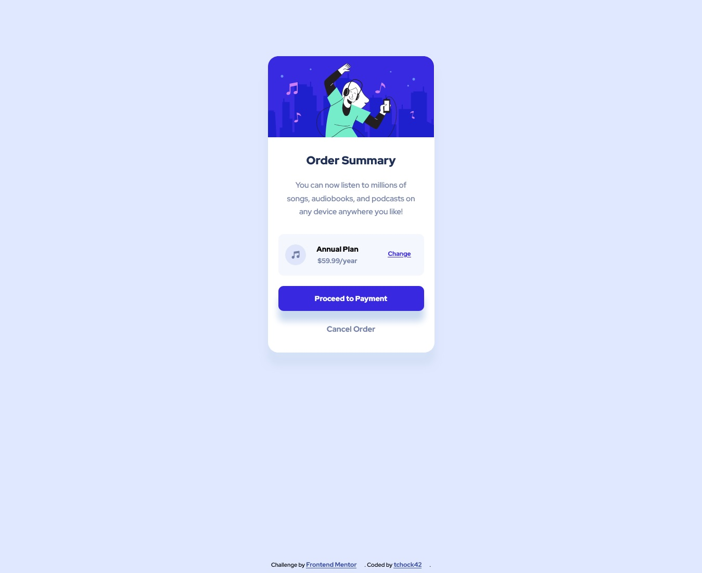

# Frontend Mentor - Order summary card solution

This is my solution to the [Order summary card challenge on Frontend Mentor](https://www.frontendmentor.io/challenges/order-summary-component-QlPmajDUj). Frontend Mentor challenges help you improve your coding skills by building realistic projects. 

## Table of contents

- [Overview](#overview)
  - [The challenge](#the-challenge)
  - [Screenshot](#screenshot)
  - [Links](#links)
- [My process](#my-process)
  - [Built with](#built-with)
  - [What I learned](#what-i-learned)
  - [Continued development](#continued-development)
  - [Useful resources](#useful-resources)
- [Author](#author)


## Overview

### The challenge

Users should be able to:

- See hover states for interactive elements

### Screenshot



Here is a screenshot of my site on desktop view.


### Links

- Solution URL: [Add solution URL here](https://github.com/tchock42/Order-summary-card-solution)
- Live Site URL: [Add live site URL here](https://tubular-conkies-c30f47.netlify.app/)

## My process

### Built with

- Semantic HTML5 markup
- CSS custom properties
- Flexbox
- Mobile-first workflow


### What I learned

This is a very simple site where I can use flexbox and states. I think this kind of sites are good to reinforce my basic css and html skills.
The following code was useful to change interline height


```css
.paragraph{
    font-weight: 500;
    color: var(--desaturatedBlue);
    padding: 0 3rem;
    margin-bottom: 1.5rem;
    text-align: center;
    line-height: 1.7;
}
```


### Continued development

I will start to making more challenging sites from frontedmentor.

### Useful resources

- [HTML color codes](https://htmlcolorcodes.com/es/) - This site always help me to select color that the style guide does not have.
- [CSSMATIC](https://www.cssmatic.com/box-shadow) - This is useful to create box shadow.


## Author

- Website - [Github](https://github.com/tchock42)
- Frontend Mentor - [@tchock42](https://www.frontendmentor.io/profile/tchock42)


